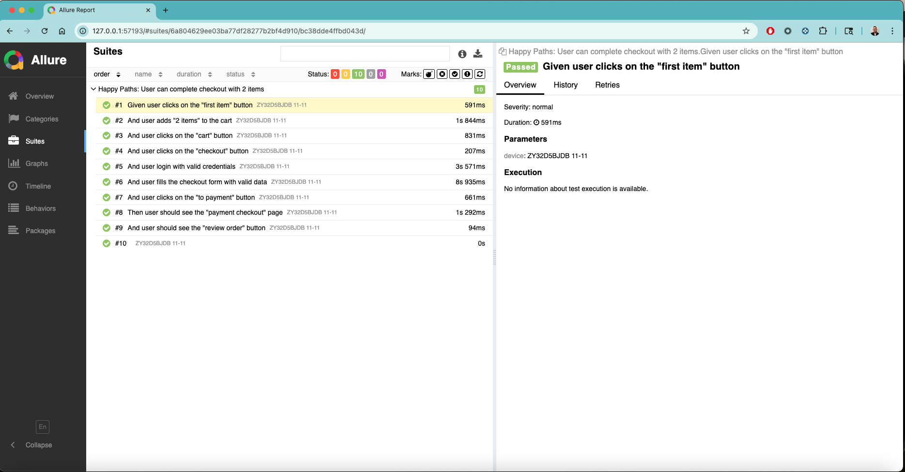

# mobile-test-automation-appium-javascript
Personal mobile test automation project with Appium and Javascript for SauceLabs demo apps

.gif>)



## Project Structure

```
├── features/
│   ├── scenarios/
│   │   └── happy-paths.feature               # Cucumber feature scenarios with Gherkin syntax
│   └── step-definitions/
│       └── steps.js                          # Step definitions for features
├── page-objects/
│   ├── name-page.js                         # Page object files with locators and functions by page
├── wdio.conf.js                              # WebdriverIO configuration
├── package.json                              # Project dependencies and scripts
└── README.md                                 # Project documentation
```

## Getting Started

### Prerequisites
- Node.js (v14 or higher recommended)
- npm
- Webdriverio
- Cucumber
- Appium server >2.0.1
- Android/iOS emulator or real device
- Apk/ipa from https://github.com/saucelabs/my-demo-app-rn/releases/tag/v1.3.0 or use the attached ones

### Installation

* Install Appium server globally following: https://appium.io/docs/en/2.19/quickstart/install/

* Install UiAutomator2 driver with:

```sh
appium driver install uiautomator2
```
* Install XCUITest driver with:

```sh
appium driver install xcuitest
```

* install project dependencies with:
```sh
npm install
```

### Add/Edit Env Variables
Set device and app details in the `.env` file and to run tests on a specific platform, set the `PLATFORM` environment variable to either `android` or `ios` before running your tests. 

## Running Tests

Start the Appium server first, then run your tests using following command. Make sure to set the `PLATFORM` variable as mentioned above.

```sh
env PLATFORM=android npx wdio run ./wdio.conf.js
```

- To run only scenarios with a specific tag (e.g., `@checkout`), use:

```sh
env PLATFORM=android npx wdio run wdio.conf.js --cucumberOpts.tagExpression="@checkout"
```

### Reporting
- The default reporter is `spec` (console output).
- Allure reporter is also enabled.
- After running your tests, you can generate and view the Allure report with:

```sh
npm run allure:generate
npm run allure:open
```

## Future Improvements
- Add wrappers to reduce code
- Add helpers (api, app interactions, etc) to support execution
- Add more devices support and capabilities
- Add some code comments
- Add AfterStep to take screenshots on failed scenarios
- Add support for a device farm
- Add support for a CI pipeline
- Add an approach to auto-generate data and handle test users
- Add an approach to rerun failed scenarios

## Useful Resources
- [WebdriverIO Documentation](https://v7.webdriver.io/docs/gettingstarted)
- [Appium Documentation](https://appium.io/docs/en/about-appium/intro/)
- [Cucumber.js Documentation](https://cucumber.io/docs/guides/10-minute-tutorials/javascript/)
- [Allure Reporter for WebdriverIO](https://webdriver.io/docs/allure-reporter/)
